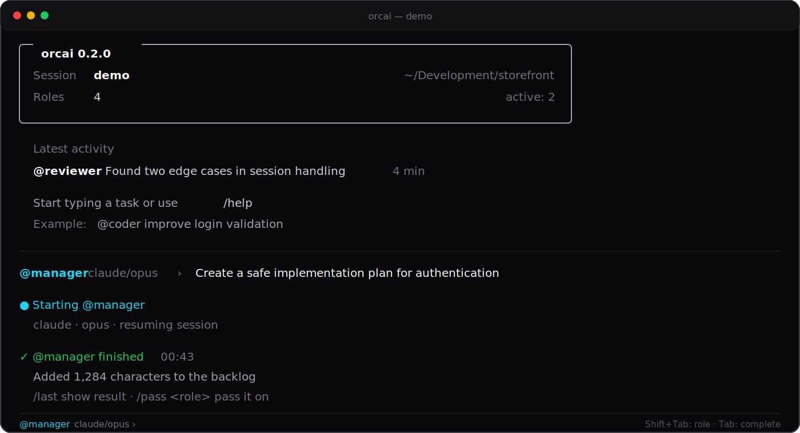

# orcai

`orcai` is a human-driven AI role orchestrator for the terminal. It lets you move work
between Codex and Claude Code while preserving a separate native conversation for every role
and a session-scoped `backlog.md` for the whole team.



You remain in control: choose a role, give it a task, review the result, and decide who should
continue. `orcai` does not run an autonomous team in the background.

`orcai` targets macOS and Linux terminals. On Windows, run it through WSL.

## Quick start with AI — recommended

Open this project in your coding assistant and say:

> Read AGENTS.md and help me configure orcai. Run a health check first, then propose a small
> set of roles. Do not overwrite anything without my approval.

The assistant will:

1. Ask which project and AI CLIs you want to use.
2. Check Bun, Codex, Claude Code, and the project directory.
3. Review or adjust the starter team of roles.
4. Show the configuration before saving anything.
5. Give you one command to start your first session.

The complete onboarding procedure is documented in [AGENTS.md](AGENTS.md).

## Manual setup

You need:

- [Bun](https://bun.sh) 1.3 or newer,
- Codex CLI, Claude Code, or both, with authentication already configured.

`orcai` is tested and targeted for macOS and Linux. Windows users should install and run it
inside WSL, where it follows the Linux behavior.

```bash
bun install
orcai new my-project /absolute/path/to/project
```

For first-time assisted onboarding, prefer the explicit `orcai new <name> <workdir>` form above:
it makes the selected project directory and session name clear before any session files are
created. After you are configured, starting `orcai` with no arguments creates a new session
with a random UUID for the current directory and enters the REPL immediately. Use
`orcai resume <uuid>` later to reopen it.

The configuration and session data are stored under:

```text
~/.orcai/
├── config.json       paths to codex and claude
├── agents.yaml       starter roles, models, and instructions (hand-editable)
└── sessions/         session state, transcripts, and per-session backlogs
```

On first run, `orcai` creates five starter roles so you can delegate immediately:

```text
manager   organize the goal and choose the next task
coder     implement changes and run tests
tester    verify behavior and reproduce failures
devops    handle CI, releases, deployment, and operations
designer  shape user-facing flows, copy, and visual direction
```

The provider determines the native CLI: `anthropic` uses Claude Code and `openai` uses Codex.
The roles are saved to `agents.yaml`; edit that file or use `/agent add` and `/agent rm` to
customize the team. Each session has its own shared backlog at
`~/.orcai/sessions/<session>/backlog.md`; roles still run in the selected project directory
and receive the session directory as an additional writable directory.

If a CLI is not available in `PATH`, put its absolute path in `config.json`:

```json
{
  "clis": {
    "claude": "/opt/homebrew/bin/claude",
    "codex": "/Users/you/.local/bin/codex"
  }
}
```

## The interface

The home screen keeps the important context visible: session name, project directory, number
of configured roles, active conversations, latest activity, and the currently selected role.
At startup, `orcai` checks whether every CLI referenced by a role is available.

You do not need to remember a command for every task:

```text
Create an implementation plan for authentication
```

Plain text is sent to the active role shown in the prompt:

```text
@manager claude/opus ›
```

Address another role directly:

```text
@coder Implement the first step and run the tests
```

Enter a role without a task to make it active:

```text
@reviewer
```

You can also switch roles with `Shift+Tab`. Press `Tab` to complete role names, commands, and
`/session` actions. Type `/` or `/help` to see contextual help. The original
`/to <role> <task>` syntax remains available.

## Example workflow

Ask the manager to define a safe plan:

```text
@manager Create a safe implementation plan for authentication
```

When the native Claude or Codex session closes, pass its backlog summary to the developer:

```text
/pass coder
```

Then request a review:

```text
/pass reviewer
```

If the reviewer reports issues, pass the result back to the developer. Inspect the latest
result or shared context at any time:

```text
/last
/backlog
```

Every launched Codex or Claude Code session remains interactive. Handle permission requests
and clarifying questions in its native interface. When it closes, you return to `orcai`
with the same active session and role context.

## Image paste

Attach an image from your system clipboard with:

```text
/paste
```

`orcai` saves the PNG under the active session and inserts a placeholder such as
`[Image #1]` into the prompt. You can also press `Ctrl+V` in terminals that pass the keypress
through to `orcai`. If your terminal captures `Ctrl+V`, use `/paste`.

Pending image placeholders are mapped to the saved files when you send the task. Codex
receives them as image arguments; Claude Code receives the placeholder-to-file mapping in the
prompt. Clear pending images without sending them:

```text
/paste clear
```

On macOS, image paste works through the system `osascript` helper, with `pngpaste` used when
it is already installed. Linux and WSL need `wl-paste` or `xclip`. Inside a launched native
Codex or Claude Code session, use that CLI's own image paste support.

## Essential commands and shortcuts

| Input | Action |
|---|---|
| plain text | send a task to the active role |
| `@role <task>` | delegate directly to a role |
| `@role` or `/role <role>` | select the active role |
| `Shift+Tab` | cycle through roles |
| `Tab` | complete roles and commands |
| `/agent add <id> <provider> <model> [backstory]` | create and save a role |
| `/agent rm <id>` | remove a role |
| `/agent list` or `/agents` | show roles, models, and their status |
| `/pass <role>` | pass the latest result to another role |
| `/paste` | attach clipboard image as `[Image #N]` |
| `/paste clear` | clear pending image attachments |
| `/last` | show the latest captured result |
| `/backlog` | show the team's shared context |
| `/home` | show the dashboard again |
| `/session new\|list\|open` | manage sessions |
| `/help` | show full help |

Resume a session later with:

```bash
orcai resume <uuid>
```

## Conversation continuity

Every role has its own session in the native CLI. Claude Code starts with an assigned session
ID. For Codex, `orcai` snapshots the local session index and identifies the newly created
conversation, preferring one whose recorded working directory matches the project. A resumed
Codex role still respects model changes made in `agents.yaml`.

Agents can edit the selected directory. For experiments, use a separate Git worktree instead
of your main branch:

```bash
git -C /path/to/repo worktree add ../repo-agents
cd /path/to/repo-agents
orcai
```

## Development

```bash
bun test
bunx tsc --noEmit
```
